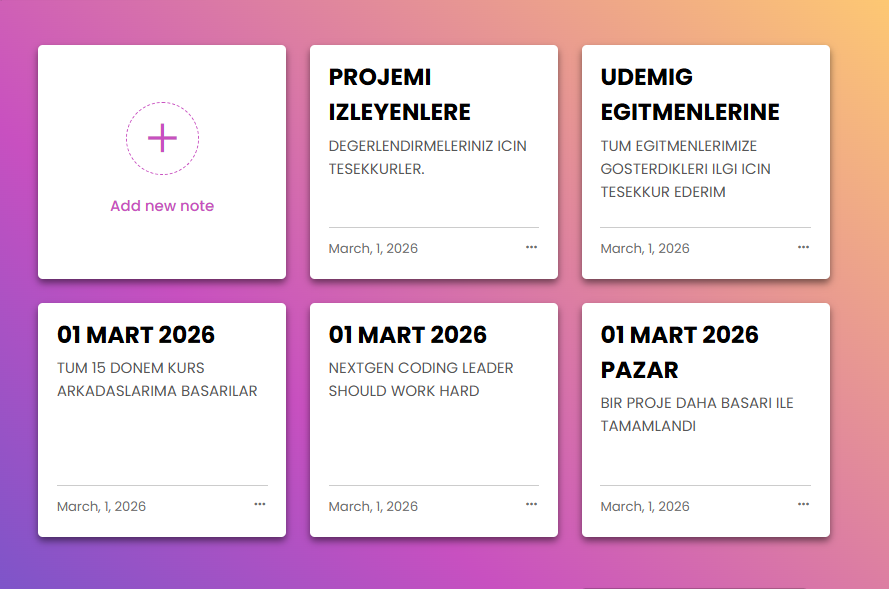
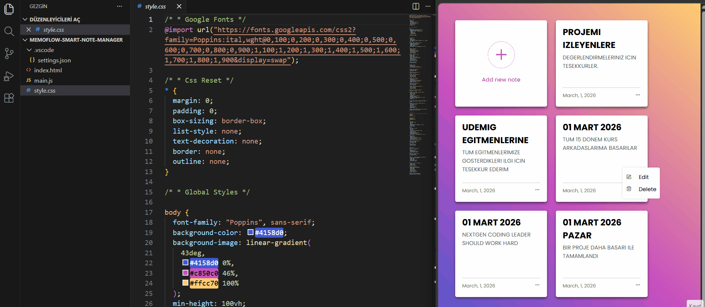

<h1 align="center">🧠 MemoFlow – Smart Note Manager</h1>

HTML, CSS ve JavaScript kullanılarak geliştirilmiş,
dinamik not oluşturma, düzenleme ve silme özelliklerine sahip
modern ve tamamen responsive <strong>Note Management Application</strong> çalışmasıdır.

<h2>📌 Proje Amacı</h2>

Bu proje, herhangi bir framework kullanılmadan
dinamik bir not yönetim sistemi geliştirmek amacıyla hazırlanmıştır.
DOM manipülasyonu, event delegation ve localStorage veri kalıcılığı
üzerine pratik yapılmıştır.

<ul>
<li>Dinamik not oluşturma</li>
<li>Not güncelleme (Edit)</li>
<li>Not silme (Delete)</li>
<li>Tarih bilgisi otomatik ekleme</li>
<li>LocalStorage ile veri kalıcılığı</li>
<li>Popup form kontrolü</li>
<li>Event Delegation yapısı</li>
</ul>

<h2>🛠 Kullanılan Teknolojiler</h2>

<ul>
<li>HTML5 (Semantic yapı)</li>
<li>CSS3 (Grid & Flexbox)</li>
<li>JavaScript (ES6)</li>
<li>LocalStorage API</li>
<li>Responsive Design</li>
<li>BoxIcons</li>
<li>Google Fonts</li>
</ul>

<h2>✨ Öne Çıkan Özellikler</h2>

<ul>
<li>Dinamik DOM oluşturma</li>
<li>CRUD operasyonları (Create, Read, Update, Delete)</li>
<li>Event Delegation ile performanslı event yönetimi</li>
<li>LocalStorage ile kalıcı veri saklama</li>
<li>Modern popup form sistemi</li>
<li>Responsive grid not yapısı</li>
<li>Minimal ve modern UI tasarımı</li>
</ul>

<h2>📂 Proje Yapısı</h2>

<pre>
memoflow-note-app/
│
├── index.html
├── style.css
├── main.js
├── image.png
└── image.gif
</pre>

<h2>📸 Proje Önizleme</h2>

<h2>🎥 Demo (GIF)</h2>

<h2>🚀 Kurulum</h2>

Projeyi klonlayın:

<pre>
git clone https://github.com/kenansonmez1617-hub/memoflow-note-app.git
</pre>

Ardından <strong>index.html</strong> dosyasını tarayıcıda açmanız yeterlidir.

<h2>👨‍💻 Geliştirici</h2>

<strong>Kenan Sönmez</strong> 
Frontend Developer

GitHub: 
<a href="https://github.com/kenansonmez1617-hub" target="_blank">
https://github.com/kenansonmez1617-hub
</a>

LinkedIn: 
<a href="https://www.linkedin.com/in/kenan-sonmez" target="_blank">
https://www.linkedin.com/in/kenan-sonmez
</a>

<h2>📄 Lisans</h2>

Bu proje eğitim ve portfolyo amaçlı geliştirilmiştir.
İncelenebilir ve geliştirilebilir.

⭐ Projeyi beğendiyseniz GitHub üzerinden yıldız bırakabilirsiniz.

